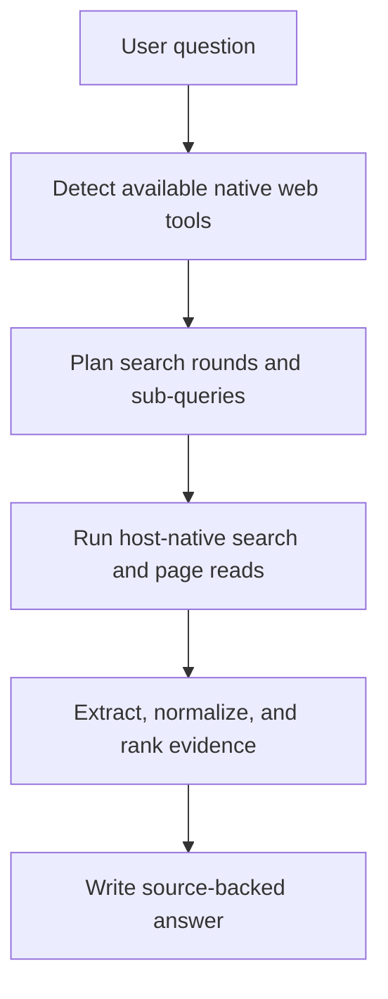

# HelloSearch

Host-agnostic real-web search skill for structured query planning, source verification, and evidence-based answers using the native web tools already available in the current environment.

[](https://www.npmjs.com/package/hellosearch)
[](./LICENSE)

[English](./README.md) · [简体中文](./README_CN.md)

## Overview

HelloSearch is a standalone skill package. It does not ship its own search backend, crawler service, or model API wrapper.

Instead, it layers a disciplined search workflow on top of the live web capability your current host already provides:

- detect whether real web search is actually available
- turn one vague request into structured search rounds and sub-queries
- prefer official and primary sources
- split mixed answer-plus-citation text when a host returns both together
- normalize, dedupe, and rank the collected evidence
- answer with explicit source discipline

### Best for

- verifying latest facts, news, releases, or pricing
- checking official documentation, changelogs, or release notes
- comparing products with source-backed evidence
- mapping documentation sites before drilling into page-level details

### Boundaries

- it cannot create live web access where the host has none
- it relies on the host's native search, fetch, open-page, or site-map tools
- the included scripts help with planning, evidence handling, and installation, but they do not replace host-native web execution

## Features

- **Pure skill architecture**: no MCP server, plugin runtime, or extra backend dependency
- **Runtime-aware routing**: inspect the current workspace and recommend the best native search path
- **Richer planning output**: infer complexity, ambiguities, sub-queries, tool selection, execution order, fetch targets, and optional site-map targets
- **Evidence extraction**: split trailing citation blocks and raw link lists out of mixed answer text
- **Evidence normalization**: canonicalize URLs, remove tracking noise, dedupe, and rank sources
- **Multi-host installer**: install into Codex, Claude Code, OpenClaw, or a custom target directory

## Quick Start

### Prerequisites

- Node.js 18 or later
- Python 3.11 or later for the helper scripts
- A host environment that already exposes real web search or page-reading capability

### Install from npm

```bash
npm install -g hellosearch
hellosearch install
```

By default, the installer auto-detects the most likely host and resolves a preset skill directory.

Inspect the resolved target before installing:

```bash
hellosearch info
hellosearch doctor
```

### Install for a specific host

```bash
hellosearch install --host codex --scope user
hellosearch install --host claude-code --scope user
hellosearch install --host openclaw --scope project
```

Override the target directory when your environment uses a custom skill path:

```bash
hellosearch install --target "/path/to/skills"
```

### Use in prompts

After the skill is installed, invoke it explicitly in your prompt when you want stricter real-web verification.

Examples:

- `Use hellosearch to verify today's API pricing and cite the official source.`
- `Use hellosearch to compare these three products and show the update date for each source.`
- `Use hellosearch to map the docs site first, then find the current rate-limit page.`
- `用 hellosearch 查官网，确认这个 SDK 当前的 breaking changes。`

## Helper Commands

These commands are mainly for local validation, customization, or extending the skill in this repository.

| Command | Purpose |
| --- | --- |
| `hellosearch install [--host <host>] [--scope <scope>] [--target <path>] [--force]` | Install or overwrite the skill payload in a target skill directory. |
| `hellosearch info [--host <host>] [--scope <scope>] [--target <path>]` | Print the resolved install plan. |
| `hellosearch doctor [--host <host>] [--scope <scope>] [--target <path>]` | Print the install plan plus package-file checks. |
| `python scripts/detect_runtime.py --json` | Inspect the current workspace and print routing hints. |
| `python scripts/plan_search.py "<question>" --json` | Build a structured query plan with complexity, sub-queries, and execution order. |
| `python scripts/extract_sources.py --input answer.md` | Split embedded citations out of mixed answer text. |
| `python scripts/rank_sources.py "<question>" --input sources.json` | Normalize and rank collected sources. |
| `python scripts/build_workflow.py "<question>"` | Combine runtime detection and search planning into one workflow bundle. |

## How It Works



### Workflow stages

1. **Runtime detection**: infer the active environment and available capabilities.
2. **Query planning**: rewrite the request into rounds, sub-queries, fetch targets, and optional site-map targets.
3. **Evidence discipline**: prefer official pages, changelogs, announcements, and strong primary reporting.
4. **Answer synthesis**: separate confirmed facts, inference, and unresolved uncertainty.

## Repository Layout

| Path | Purpose |
| --- | --- |
| `SKILL.md` | Main skill instructions and trigger description. |
| `agents/openai.yaml` | UI-facing metadata for hosts that read agent descriptors. |
| `references/` | Routing and evidence reference material used by the skill. |
| `scripts/` | Python helper scripts and the runtime implementation. |
| `bin/hellosearch.mjs` | npm CLI entry point. |
| `lib/install-skill.mjs` | Installer implementation and host-specific target resolution. |
| `tests/` and `node-tests/` | Python and Node test coverage. |

## Local Validation

```bash
npm run test
npm run pack:dry
```

## License

This repository is licensed under the [Apache-2.0 License](./LICENSE).
