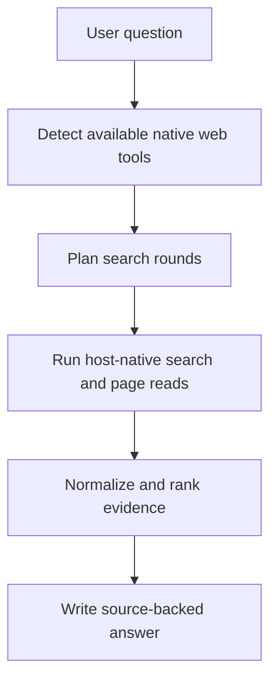

# HelloSearch

Host-agnostic real-web search skill for structured query planning, source verification, and evidence-based answers using the native web tools already available in the current environment.

[](https://www.npmjs.com/package/hellosearch)
[](./LICENSE)

[English](./README.md) · [简体中文](./README_CN.md)

## Overview

HelloSearch is a standalone skill package. It does not ship its own search backend, crawler service, or model API wrapper.

Instead, it adds a disciplined search workflow on top of the live web capability your current host already provides:

- decide whether live search is actually available
- turn one vague request into multi-round search intents
- prefer official and primary sources
- normalize and rank collected evidence
- answer with clear source discipline

### Best for

- verifying latest facts, news, releases, or pricing
- checking official documentation or changelogs
- comparing products with source-backed evidence
- forcing a more rigorous search workflow inside a skill-enabled host

### Boundaries

- it cannot create live web access where the host has none
- it relies on the host's native search, fetch, or page-open tools
- the included Python scripts help with planning and validation, but they do not replace host-native web execution

## Features

- **Pure skill architecture**: no MCP server, plugin runtime, or extra backend dependency.
- **Runtime-aware routing**: inspect the current workspace and recommend the best native search path.
- **Deterministic query planning**: expand relative dates, infer source priorities, and build two-round search plans.
- **Evidence normalization**: canonicalize URLs, remove tracking noise, dedupe, and rank sources.
- **Install CLI**: copy the skill payload into a target skill directory with one command.

## Quick Start

### Prerequisites

- Node.js 18 or later
- Python 3.11 or later for the helper scripts
- A host environment that already exposes real web search or page-reading capability

### Install from npm

```bash
npm install -g hellosearch
hellosearch install
```

By default, the installer writes the skill to `$CODEX_HOME/skills` or `~/.codex/skills`.

If your tool uses another skill directory, install to a custom target:

```bash
hellosearch install --target "/path/to/skills"
```

To inspect the resolved install target:

```bash
hellosearch info
```

### Use in prompts

After the skill is installed, invoke it explicitly in your prompt when you want stricter real-web verification.

Examples:

- `Use hellosearch to verify today's API pricing and cite the official source.`
- `Use hellosearch to compare these three products and show the update date for each source.`
- `用 hellosearch 查官网，确认这个 SDK 当前的 breaking changes。`

## Helper Commands

These commands are mainly for local validation, customization, or extending the skill in this repository.

| Command | Purpose |
| --- | --- |
| `hellosearch install [--target <path>] [--force]` | Install or overwrite the skill payload in a target skill directory. |
| `hellosearch info` | Print package root, skill name, default target, and copied paths. |
| `python scripts/detect_runtime.py --json` | Inspect the current workspace and print routing hints. |
| `python scripts/plan_search.py "<question>" --json` | Build a deterministic query plan from one user request. |
| `python scripts/rank_sources.py "<question>" --input sources.json` | Normalize and rank collected sources. |
| `python scripts/build_workflow.py "<question>"` | Combine runtime detection and search planning into one workflow bundle. |

## How It Works



### Workflow stages

1. **Runtime detection**: infer the active environment and available capabilities.
2. **Query planning**: rewrite the request into concrete search rounds and fetch targets.
3. **Evidence discipline**: prefer official pages, changelogs, announcements, and strong primary reporting.
4. **Answer synthesis**: separate confirmed facts, inference, and unresolved uncertainty.

## Repository Layout

| Path | Purpose |
| --- | --- |
| `SKILL.md` | Main skill instructions and trigger description. |
| `agents/openai.yaml` | UI-facing metadata for hosts that read agent descriptors. |
| `references/` | Routing and evidence reference material used by the skill. |
| `scripts/` | Python helper scripts and the runtime model implementation. |
| `bin/hellosearch.mjs` | npm CLI entry point. |
| `lib/install-skill.mjs` | Installer implementation used by the CLI. |
| `tests/` and `node-tests/` | Python and Node test coverage. |

## Local Validation

```bash
npm run test
npm run pack:dry
```

## License

This repository is licensed under the [Apache-2.0 License](./LICENSE).
