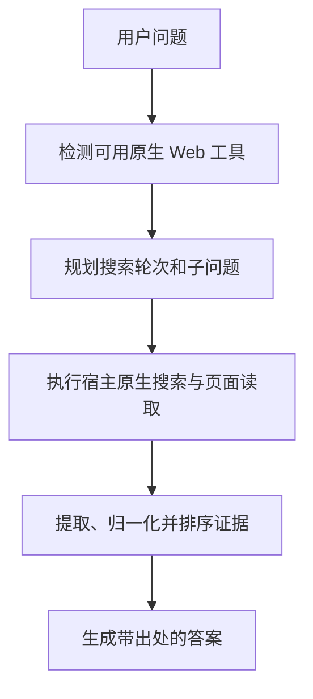

# HelloSearch

HelloSearch 是一个独立的真实搜索 skill，用于在当前环境已具备的原生 Web 搜索与页面读取能力之上，增加结构化查询规划、来源核验和证据化回答流程。

[](https://www.npmjs.com/package/hellosearch)
[](./LICENSE)

[English](./README.md) · [简体中文](./README_CN.md)

## 概览

HelloSearch 是一个纯 skill 分发包，不自带搜索后端、抓取服务，也不是模型 API 包装层。

它做的是把一套更严格的真实搜索方法，叠加到你当前宿主已经提供的实时 Web 能力之上：

- 先判断当前环境是否真的具备实时搜索能力
- 把模糊问题拆成结构化搜索轮次和子问题
- 优先查官方与一手来源
- 当宿主返回“答案 + 引用”混合文本时，先把来源拆出来
- 对证据做归一化、去重和排序
- 最终按来源纪律输出答案

### 适合场景

- 核验最新事实、新闻、发布动态或价格信息
- 查官网文档、更新日志、发行说明
- 对多个产品做带出处的对比
- 在深挖页面前先梳理文档站结构

### 使用边界

- 如果当前宿主没有真实 Web 能力，它不会凭空创造联网搜索
- 它依赖宿主已有的原生搜索、抓取、页面打开或站点映射工具
- 仓库里的脚本主要用于规划、证据处理和安装，不替代宿主真实执行搜索

## 功能特性

- **纯 skill 架构**：不依赖 MCP、插件运行时或额外搜索后端
- **运行时路由判断**：检查当前工作区环境，给出优先使用的原生搜索路径
- **更丰富的规划输出**：自动推断复杂度、歧义、子问题、工具选择、执行顺序、页面抓取目标和站点映射目标
- **来源提取**：能把混合在回答里的引用块、链接列表拆出来
- **证据归一化**：标准化 URL、去掉追踪参数、去重并排序来源
- **多宿主安装**：支持安装到 Codex、Claude Code、OpenClaw 或自定义 skill 目录

## 快速开始

### 前置条件

- Node.js 18+
- Python 3.11+（用于辅助脚本）
- 当前宿主已经提供真实 Web 搜索或页面读取能力

### 从 npm 安装

```bash
npm install -g hellosearch
hellosearch install
```

默认会自动检测最可能的宿主，并解析预设 skill 目录。

安装前先查看目标路径：

```bash
hellosearch info
hellosearch doctor
```

### 指定宿主安装

```bash
hellosearch install --host codex --scope user
hellosearch install --host claude-code --scope user
hellosearch install --host openclaw --scope project
```

如果你的环境使用自定义 skill 路径，可以手动覆盖：

```bash
hellosearch install --target "/path/to/skills"
```

### 在提示词中使用

安装完成后，当你希望回答必须经过更严格的实时搜索核验时，可以在提示词中显式调用它。

示例：

- `Use hellosearch to verify today's API pricing and cite the official source.`
- `Use hellosearch to compare these three products and show the update date for each source.`
- `Use hellosearch to map the docs site first, then find the current rate-limit page.`
- `用 hellosearch 查官网，确认这个 SDK 当前的 breaking changes。`

## 辅助命令

以下命令主要用于本仓库的本地验证、定制或扩展。

| 命令 | 作用 |
| --- | --- |
| `hellosearch install [--host <host>] [--scope <scope>] [--target <path>] [--force]` | 安装或覆盖目标目录中的 skill 内容 |
| `hellosearch info [--host <host>] [--scope <scope>] [--target <path>]` | 输出解析后的安装计划 |
| `hellosearch doctor [--host <host>] [--scope <scope>] [--target <path>]` | 输出安装计划并检查包内关键文件 |
| `python scripts/detect_runtime.py --json` | 检查当前工作区环境并输出路由建议 |
| `python scripts/plan_search.py "<问题>" --json` | 生成包含复杂度、子问题和执行顺序的搜索计划 |
| `python scripts/extract_sources.py --input answer.md` | 从混合回答文本里拆出来源 |
| `python scripts/rank_sources.py "<问题>" --input sources.json` | 对已收集来源做归一化与排序 |
| `python scripts/build_workflow.py "<问题>"` | 一次输出运行时检测和搜索规划结果 |

## 工作原理



### 阶段说明

1. **运行时检测**：推断当前环境与可用能力。
2. **查询规划**：把请求改写成搜索轮次、子问题、页面抓取目标和可选的站点映射目标。
3. **证据纪律**：优先使用官网、更新日志、官方公告和高质量一手报道。
4. **答案合成**：区分已确认事实、合理推断与未消除的不确定性。

## 仓库结构

| 路径 | 说明 |
| --- | --- |
| `SKILL.md` | skill 主说明与触发描述 |
| `agents/openai.yaml` | 供部分宿主读取的界面元数据 |
| `references/` | 路由和证据策略参考资料 |
| `scripts/` | Python 辅助脚本与运行时实现 |
| `bin/hellosearch.mjs` | npm CLI 入口 |
| `lib/install-skill.mjs` | 安装逻辑与宿主目标路径解析 |
| `tests/` 与 `node-tests/` | Python 与 Node 测试 |

## 本地验证

```bash
npm run test
npm run pack:dry
```

## 许可证

本项目采用 [Apache-2.0 许可证](./LICENSE)。
