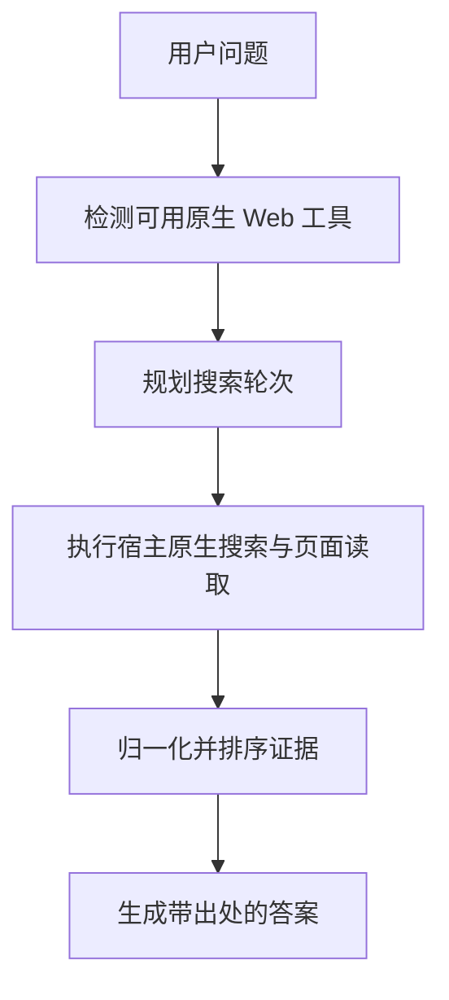

# HelloSearch

HelloSearch 是一个独立的真实搜索 skill，用于在当前环境已具备的原生 Web 搜索与页面读取能力之上，增加结构化查询规划、来源核验和证据化回答流程。

[](https://www.npmjs.com/package/hellosearch)
[](./LICENSE)

[English](./README.md) · [简体中文](./README_CN.md)

## 概览

HelloSearch 是一个纯 skill 分发包，不自带搜索后端、爬虫服务，也不是模型 API 包装层。

它做的是把一套更严格的真实搜索方法，叠加到你当前宿主已经提供的实时 Web 能力之上：

- 先判断当前环境是否真的具备实时搜索能力
- 把模糊问题拆成多轮搜索意图
- 优先查官方与一手来源
- 对收集到的证据做归一化、去重和排序
- 最终按来源纪律输出答案

### 适合场景

- 核验最新事实、新闻、发布动态或价格信息
- 查官网文档、更新日志、发行说明
- 对多个产品做带出处的对比
- 在支持 skill 的宿主中，强制使用更严谨的真实搜索流程

### 使用边界

- 如果当前宿主没有真实 Web 能力，它不会凭空创造联网搜索
- 它依赖宿主已有的原生搜索、抓取或页面打开工具
- 仓库里的 Python 脚本主要用于规划、验证和扩展，不替代宿主真实执行搜索

## 功能特性

- **纯 skill 架构**：不依赖 MCP、插件运行时或额外搜索后端。
- **运行时路由判断**：检查当前工作区环境，给出优先使用的原生搜索路径。
- **确定性查询规划**：展开相对日期，推断来源优先级，生成两轮搜索计划。
- **证据归一化**：标准化 URL、去掉追踪参数、去重并排序来源。
- **安装 CLI**：用一条命令把 skill 内容复制到目标 skill 目录。

## 快速开始

### 前置条件

- Node.js 18+
- Python 3.11+（用于辅助脚本）
- 当前宿主已经提供真实 Web 搜索或页面读取能力

### 从 npm 安装

```bash
npm install -g hellosearch
hellosearch install
```

默认会安装到 `$CODEX_HOME/skills` 或 `~/.codex/skills`。

如果你的工具使用其他 skill 目录，可以指定目标路径：

```bash
hellosearch install --target "/path/to/skills"
```

查看最终安装目标：

```bash
hellosearch info
```

### 在提示词中使用

安装完成后，当你希望回答必须经过更严格的实时搜索核验时，可以在提示词中显式调用它。

示例：

- `Use hellosearch to verify today's API pricing and cite the official source.`
- `Use hellosearch to compare these three products and show the update date for each source.`
- `用 hellosearch 查官网，确认这个 SDK 当前的 breaking changes。`

## 辅助命令

以下命令主要用于本仓库的本地验证、定制或扩展。

| 命令 | 作用 |
| --- | --- |
| `hellosearch install [--target <path>] [--force]` | 安装或覆盖目标目录中的 skill 内容。 |
| `hellosearch info` | 输出包根目录、skill 名称、默认安装目录和复制内容。 |
| `python scripts/detect_runtime.py --json` | 检查当前工作区环境并输出路由建议。 |
| `python scripts/plan_search.py "<问题>" --json` | 把单个问题转成确定性的搜索计划。 |
| `python scripts/rank_sources.py "<问题>" --input sources.json` | 对已收集来源做归一化与排序。 |
| `python scripts/build_workflow.py "<问题>"` | 一次输出运行时检测和搜索规划结果。 |

## 工作原理



### 阶段说明

1. **运行时检测**：推断当前环境与可用能力。
2. **查询规划**：把请求改写成明确的搜索轮次和页面抓取目标。
3. **证据纪律**：优先使用官网、更新日志、官方公告和高质量一手报道。
4. **答案合成**：区分已确认事实、合理推断与未消除的不确定性。

## 仓库结构

| 路径 | 说明 |
| --- | --- |
| `SKILL.md` | skill 主说明与触发描述。 |
| `agents/openai.yaml` | 供部分宿主读取的界面元数据。 |
| `references/` | 路由和证据策略参考资料。 |
| `scripts/` | Python 辅助脚本与运行时模型实现。 |
| `bin/hellosearch.mjs` | npm CLI 入口。 |
| `lib/install-skill.mjs` | CLI 使用的安装逻辑。 |
| `tests/` 与 `node-tests/` | Python 与 Node 测试。 |

## 本地验证

```bash
npm run test
npm run pack:dry
```

## 许可证

本项目采用 [Apache-2.0 许可证](./LICENSE)。
